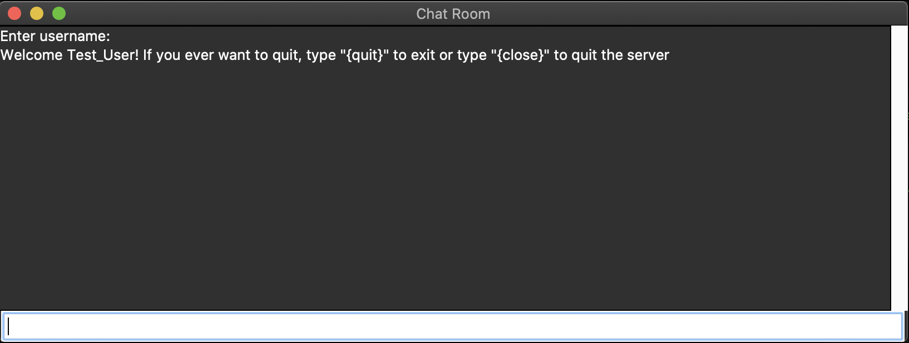
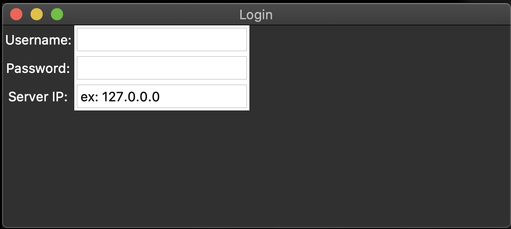

# Gui_chatroom

Its a chatroom with a Gui login, the login is all mine but the chatroom has some inspiration from stackoverflow
# Instalation
```
$ git clone https://github.com/thepythonscript/gui_chatroom
```
# Running the server
```
$ ./server
```
If that doesnt work try:
```
$ python(3) server
```
# Running and using the Client
### Running the Client
```
$ ./chatroom
```
### Using the Client

Right now you cant create a new user in the program you can only hard code it into the `login_info.txt`
like this 
> note that the `Return` key is Binded to login on server ip
```
$ nano login_info.txt
```
> inside nano
```
{"test_user" : "password"}
```
and change it to
```
{"test_user" : "password", "your_user" : "your_password"}
```
> btw you can have spaces in your username and password(I just have a habit of putting underscores instead of spaces)

# ToDo
- [x] Make a create user page
- [ ] Make a settings page
- [ ] Make background music with pygame
- [ ] Encode the login info then decode it inside the program
